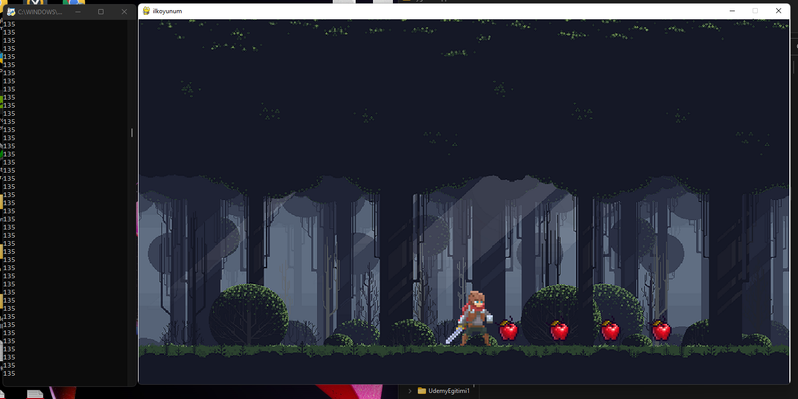

# Apple game 
### *A educative python 2D game project using pygame module .*
#### What's inside the project ?
- Ability to control character with w,a,s,d keys 
- Character moves along with own animations
- Whenever you collect apples the score is refreshed on the panel
- Two different attack animations are activated when you press the right or left click
- Character can deactivate attack mode by pressing "r" keys and and it happens at the same time as this animation, if player right or left clicks it will activate attack mode again

> ## This is how it looks 
